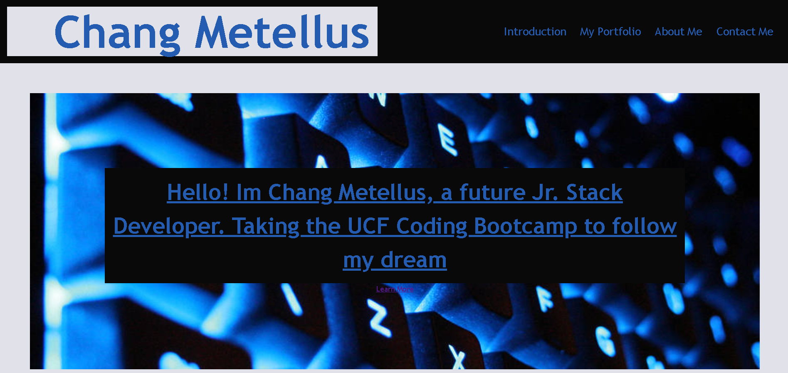

# <Your-Project-Title>

## Description

The point of this website is to broadcast my skill to future employers and give a brief introduction of myself. I provide ways of contacting me, links to projects I done, and an overall picture of myself and what should the people expect. Also, I will be adding future projects on here so to always keep it fresh and up-to-date.

## Installation

Just scroll the page and enjoy the content. 😁

## Usage

## Credits

List your collaborators, if any, with links to their GitHub profiles.

If you used any third-party assets that require attribution, list the creators with links to their primary web presence in this section.

If you followed tutorials, include links to those here as well.

## License

MIT Licence
